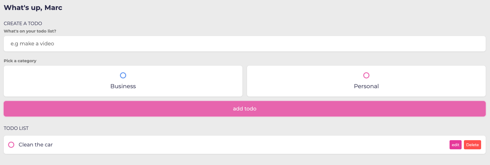

# Todo List Application

I am currently enrolled on a frontend-web bootcamp and wanted to practice some of the skills I have picked up along the way. Following this tutorial (details in credits) helped reinforce some of the concepts I have learnt over the last 7 weeks and made it easier for me to piece things together.

## The Task:

• Add local storage to the app.

**Instructions**

## Installation

Go to the following URL and create a list of tasks!

URL: https://shaky411.github.io/Task-List

## Usage

## Screenshots

## Credits

I followed a course that was made by Tyler Potts, link to his channel can be found below.

Tyler Potts: https://www.youtube.com/@TylerPotts

## License

Please refer to the license in the repo.